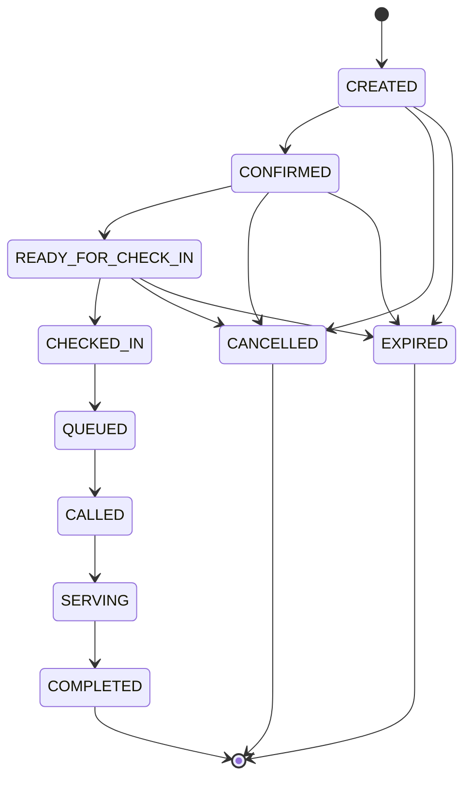
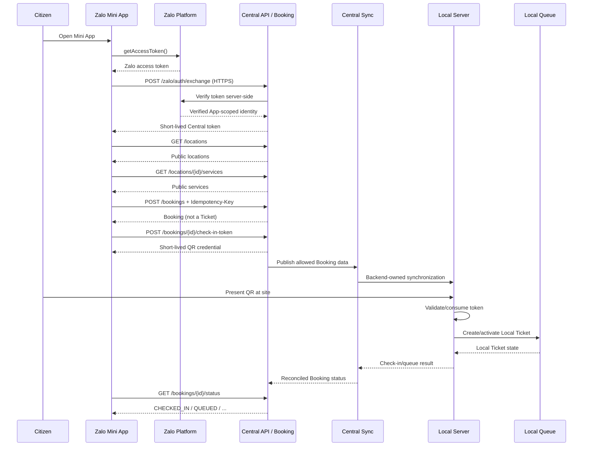

# Zalo Central Booking API Contract

> Status: **DRAFT**  
> Consumer: `Zalo_App`  
> Owner of production implementation: Central Backend team  
> Every endpoint, field, status, error code, and policy in this document is
> `BACKEND_CONFIRMATION_REQUIRED` unless explicitly stated otherwise.  
> Cryptographic and credential decisions are `SECURITY_CONFIRMATION_REQUIRED`.

## 1. Purpose and boundary

This document proposes the minimum Central Booking REST contract needed by the
Zalo Mini App. It is not an approved Backend API and must not be implemented as
a production contract until Backend and Security review it.

```text
Zalo Mini App
  -> Central HTTPS REST API
  -> Central Booking
  -> Backend-owned Central sync
  -> Local check-in
  -> Local queue Ticket
```

Fixed architectural constraints:

- `Zalo_App` calls only the Central HTTPS API. It never calls a Local Server,
  Local database, Local MQTT broker, or Local queue endpoint.
- A `Booking` is a Central reservation. A `Ticket` is Local queue state. Their
  identifiers and status values are separate.
- Central-to-Local synchronization, check-in validation, Ticket creation, and
  status reconciliation are Backend-owned.
- Raw CCCD is prohibited in requests, responses, URLs, QR codes, logs,
  analytics, and test data.
- The MVP does not request Zalo profile, name, avatar, phone, or location.

## 2. Sources and Zalo authentication assumptions

Official Zalo Mini App documentation checked for this DRAFT:

- [`getAccessToken`](https://mini.zalo.me/documents/api/getAccessToken/): imports
  from `zmp-sdk/apis`, returns `Promise<string>`, and since SDK 2.35.0 the
  default token is available without requesting user consent and can be used
  only to retrieve the Zalo App-scoped user ID unless additional scopes are
  authorized.
- [`getUserID`](https://mini.zalo.me/documents/api/getUserID/): supported since
  SDK 2.32.2, returns the Zalo App-scoped user identifier, and does not require
  user confirmation.
- [`authorize`](https://mini.zalo.me/documents/api/authorize/): documents
  explicit scopes such as `scope.userInfo` and `scope.userPhonenumber`. These
  scopes are not requested by this MVP.

The official pages displayed “Cập nhật lần cuối: 8/1/2026” when reviewed. The
exact Central server-side Zalo verification API, credentials, trust model, and
failure mapping are `BACKEND_CONFIRMATION_REQUIRED`.

### 2.1 Proposed exchange flow

1. Mini App calls Zalo SDK `getAccessToken()` only when starting an authenticated
   booking action.
2. Mini App sends the token once over HTTPS in the body of
   `POST /api/v1/zalo/auth/exchange`.
3. Central verifies the token with Zalo server-side and resolves the Zalo
   App-scoped user ID. The verification mechanism is
   `BACKEND_CONFIRMATION_REQUIRED`.
4. Central creates its own short-lived session and returns a Central access
   token. Token format, lifetime, refresh, rotation, and revocation are
   `BACKEND_CONFIRMATION_REQUIRED` and `SECURITY_CONFIRMATION_REQUIRED`.
5. Mini App keeps the Central token in memory. It must not use `localStorage`.
   Session storage is not part of this DRAFT.
6. The Zalo access token is not reused as the Central session token and must
   never be logged.

Any Zalo App secret, verification secret, signing key, or Central service
credential belongs only in a server-side secret manager. It must never be
shipped to the Mini App, placed in a `VITE_*` variable, or returned by an API.

The exchange request intentionally does not accept a client-provided Zalo user
ID. Central must derive identity from the verified Zalo token to avoid trusting
a spoofable identifier. `getUserID()` may be used by the UI only if a future
approved flow requires it; it is not needed by the proposed exchange payload.

## 3. Protocol conventions

All conventions below are **DRAFT** and `BACKEND_CONFIRMATION_REQUIRED`.

| Concern              | Proposed rule                                                                                |
| -------------------- | -------------------------------------------------------------------------------------------- |
| Base path            | `/api/v1`                                                                                    |
| Production transport | HTTPS only; reject plaintext HTTP                                                            |
| Content type         | `application/json; charset=utf-8`                                                            |
| Time                 | UTC ISO-8601 with `Z`, for example `2026-06-22T08:30:00.000Z`                                |
| Identifiers          | UUID or opaque, non-sequential strings; format is not a client contract                      |
| Authentication       | `Authorization: Bearer <central-access-token>` after exchange                                |
| Request ID           | Client may send `X-Request-ID`; Server returns `X-Request-ID`                                |
| Idempotency          | `Idempotency-Key` required for booking creation, cancellation, and check-in-token issuance   |
| Pagination           | `page` is 1-based; `pageSize` default 20, proposed maximum 100                               |
| CORS                 | Exact Mini App/web origins, headers, and credential mode are `BACKEND_CONFIRMATION_REQUIRED` |
| Rate limiting        | Per Central session/user/IP as approved; return `429` and `Retry-After`                      |
| Cache                | Auth, booking, status, and QR responses use `Cache-Control: no-store`                        |

Client-provided request IDs and idempotency keys must be opaque and must not
contain user identifiers, phone numbers, or booking content.
Central scopes each idempotency record to the authenticated principal, HTTP
method, and canonical path; the same key used by another principal or endpoint
must not expose or replay the first result. Raw keys are not logged.

### 3.1 Success and error envelope

This DRAFT selects the current `@qms/contracts` nested envelope as its single
proposed wire shape without making that shape official:

```json
{
  "success": true,
  "data": {}
}
```

```json
{
  "success": false,
  "error": {
    "code": "INVALID_REQUEST",
    "message": "Yêu cầu không hợp lệ.",
    "details": {
      "field": "locationId"
    }
  }
}
```

`details` must contain only safe validation metadata. It must not echo tokens,
QR values, request bodies, or PII. Error localization and the complete catalog
are `BACKEND_CONFIRMATION_REQUIRED`.

All proposed success and non-2xx responses use this nested shape. A flat
`{ "code", "message", "details" }` error body is not part of this DRAFT.
Compatibility issue: the shared HTTP client's current non-2xx parser recognizes
that flat shape, so it must be updated in a later implementation task if Backend
approves this proposal. Final Backend approval remains
`BACKEND_CONFIRMATION_REQUIRED`.

### 3.2 Proposed common error codes

|    HTTP | Code                        | Meaning                                      | Retry                                                   |
| ------: | --------------------------- | -------------------------------------------- | ------------------------------------------------------- |
|     400 | `INVALID_REQUEST`           | Invalid path/query/body/header               | Fix request; do not retry unchanged                     |
|     401 | `UNAUTHORIZED`              | Missing, invalid, or expired Central session | Re-authenticate once                                    |
|     403 | `FORBIDDEN`                 | Session cannot access the resource/location  | Do not retry                                            |
|     404 | `RESOURCE_NOT_FOUND`        | Resource absent or hidden by authorization   | Do not retry unchanged                                  |
|     409 | `BOOKING_CONFLICT`          | Booking state does not permit the command    | Refresh detail/status                                   |
|     409 | `IDEMPOTENCY_CONFLICT`      | Same key was reused with a different request | Generate a new key only for a new intent                |
|     422 | `VALIDATION_FAILED`         | Semantically invalid booking selection       | Correct user input                                      |
|     429 | `RATE_LIMITED`              | Rate limit exceeded                          | Honor `Retry-After`                                     |
|     500 | `INTERNAL_ERROR`            | Unexpected Central error                     | Bounded retry with jitter                               |
| 502/503 | `UPSTREAM_ZALO_UNAVAILABLE` | Zalo verification unavailable                | Bounded retry; do not create parallel sessions          |
|     503 | `SYNC_UNAVAILABLE`          | Central/Local synchronization unavailable    | Show pending/error state; do not claim check-in success |

## 4. Domain models

### 4.1 Booking versus Local Ticket

| Concept        | Owner                     | Identifier  | Purpose                                     |
| -------------- | ------------------------- | ----------- | ------------------------------------------- |
| `Booking`      | Central Booking           | `bookingId` | Reservation and check-in lifecycle          |
| Local `Ticket` | Local Server/Queue Engine | `ticketId`  | Operational queue lifecycle at one location |

Rules:

- `bookingId` must never be reused as `ticketId`.
- The Mini App must not infer a Local Ticket from a successful Booking.
- Mapping ownership, whether a Local Ticket ID is exposed to Central, and how
  status reconciliation works are `BACKEND_CONFIRMATION_REQUIRED`.
- The MVP response does not expose `ticketId`.

### 4.2 Booking model

```json
{
  "bookingId": "bkg_demo_7q4m2k",
  "bookingReference": "BK-7Q4M2K",
  "locationId": "loc_demo_01",
  "serviceId": "svc_demo_01",
  "status": "CONFIRMED",
  "requestedStartAt": "2026-06-23T02:00:00.000Z",
  "createdAt": "2026-06-22T08:30:00.000Z",
  "updatedAt": "2026-06-22T08:30:00.000Z",
  "canCancel": true
}
```

Every field is **DRAFT** and `BACKEND_CONFIRMATION_REQUIRED`. The human-readable
`bookingReference` must be random/non-sensitive and must not encode identity,
phone, CCCD, or Zalo user ID. Whether appointment time is required or optional
is also `BACKEND_CONFIRMATION_REQUIRED`.

### 4.3 BookingStatus

Proposed string union, entirely **DRAFT**:

```text
CREATED
CONFIRMED
READY_FOR_CHECK_IN
CHECKED_IN
QUEUED
CALLED
SERVING
COMPLETED
CANCELLED
EXPIRED
```

Proposed transitions:



All transitions, cancellation windows, expiry rules, skipped/rejected states,
and whether Central mirrors every Local queue state are
`BACKEND_CONFIRMATION_REQUIRED`. Terminal states are proposed as `COMPLETED`,
`CANCELLED`, and `EXPIRED`.

## 5. Endpoint summary

All rows have status **DRAFT / BACKEND_CONFIRMATION_REQUIRED**.

| Method | Path                                          | Purpose                                 | Auth               | Idempotency          |
| ------ | --------------------------------------------- | --------------------------------------- | ------------------ | -------------------- |
| POST   | `/api/v1/zalo/auth/exchange`                  | Exchange Zalo token for Central session | Zalo token in body | Retry policy pending |
| GET    | `/api/v1/locations`                           | List bookable locations                 | Central Bearer     | Safe GET             |
| GET    | `/api/v1/locations/{locationId}/services`     | List bookable services                  | Central Bearer     | Safe GET             |
| POST   | `/api/v1/bookings`                            | Create Booking                          | Central Bearer     | Required key         |
| GET    | `/api/v1/bookings/{bookingId}`                | Get full Booking projection             | Central Bearer     | Safe GET             |
| GET    | `/api/v1/bookings/{bookingId}/status`         | Poll lightweight status                 | Central Bearer     | Safe GET             |
| POST   | `/api/v1/bookings/{bookingId}/check-in-token` | Issue/rotate QR credential              | Central Bearer     | Required key         |
| POST   | `/api/v1/bookings/{bookingId}/cancel`         | Cancel eligible Booking                 | Central Bearer     | Required key         |

Status remains separate from detail so the Mini App can poll a small projection
without repeatedly transferring location/service metadata. Backend may later
merge it into detail and use conditional GET/SSE; that choice is
`BACKEND_CONFIRMATION_REQUIRED`.

`POST` is selected for check-in-token issuance because issuing or rotating a
credential is security-sensitive, must not be cached, and may consume a nonce.
Using `GET` for credential creation is not recommended. This choice is
`BACKEND_CONFIRMATION_REQUIRED` and `SECURITY_CONFIRMATION_REQUIRED`.

`POST .../cancel` represents an authorized lifecycle transition with conflict
and synchronization rules; it does not delete the Booking resource. Therefore
`DELETE /bookings/{bookingId}` is not proposed.

## 6. Endpoint details

### 6.1 POST `/api/v1/zalo/auth/exchange`

**Purpose:** Exchange a short-lived Zalo Mini App access token for a separate,
short-lived Central session.

- **Authentication:** no Central Bearer token. The body contains a Zalo access
  token obtained from the official SDK. Server-side verification is
  `BACKEND_CONFIRMATION_REQUIRED`.
- **Headers:** `Accept`, `Content-Type`, optional `X-Request-ID`;
  `Cache-Control: no-store` on response.
- **Path/query:** none.
- **Body:**

```json
{
  "zaloAccessToken": "<redacted-zalo-token>"
}
```

- **Success `200`:**

```json
{
  "success": true,
  "data": {
    "accessToken": "<redacted-central-token>",
    "expiresAt": "2026-06-22T08:45:00.000Z",
    "sessionId": "ses_opaque_draft"
  }
}
```

- **Errors:** `400 INVALID_REQUEST`, `401 UNAUTHORIZED`,
  `429 RATE_LIMITED`, `502/503 UPSTREAM_ZALO_UNAVAILABLE`,
  `500 INTERNAL_ERROR`.
- **Idempotency/retry:** do not send `Idempotency-Key` in this DRAFT. Retry only
  on network/502/503 with bounded backoff. Whether repeated exchange reuses or
  rotates a Central session is `BACKEND_CONFIRMATION_REQUIRED`.
- **Allowed logging:** request ID, result code, latency, coarse SDK/API version
  if supplied separately. Do not log either token, Zalo user ID, or body.
- **PII classification:** Zalo token and derived Zalo user ID are sensitive
  authentication/pseudonymous data. Central token is a credential. None may be
  exposed to analytics or application logs.

Refresh tokens are intentionally excluded from MVP. Re-exchange, refresh, and
revocation strategy are `BACKEND_CONFIRMATION_REQUIRED` and
`SECURITY_CONFIRMATION_REQUIRED`.

### 6.2 GET `/api/v1/locations`

**Purpose:** List active Central locations available for booking.

- **Authentication:** Central Bearer token.
- **Headers:** `Accept`, `Authorization`, optional `X-Request-ID`.
- **Query:** optional `page`, `pageSize`; filtering/search is
  `BACKEND_CONFIRMATION_REQUIRED`.
- **Success `200`:**

```json
{
  "success": true,
  "data": {
    "items": [
      {
        "locationId": "loc_demo_01",
        "code": "DEMO-01",
        "displayName": "Điểm triển khai Demo",
        "displayAddress": "Địa chỉ công khai của điểm phục vụ",
        "timeZone": "Asia/Ho_Chi_Minh"
      }
    ],
    "totalItems": 1,
    "page": 1,
    "pageSize": 20,
    "totalPages": 1
  }
}
```

- **Errors:** `401`, `403`, `429`, `500` using the common catalog.
- **Idempotency/retry:** safe/idempotent GET; bounded retry on network/5xx.
- **Allowed logging:** request ID, page/pageSize, response count, latency.
- **PII classification:** location name/address are public organizational data,
  not citizen PII. Do not include staff contact data.

### 6.3 GET `/api/v1/locations/{locationId}/services`

**Purpose:** List services bookable at a selected location.

- **Authentication:** Central Bearer token.
- **Headers:** `Accept`, `Authorization`, optional `X-Request-ID`.
- **Path:** opaque `locationId`; never put user identity in the path.
- **Query:** optional `page`, `pageSize`.
- **Success `200`:**

```json
{
  "success": true,
  "data": {
    "items": [
      {
        "serviceId": "svc_demo_01",
        "locationId": "loc_demo_01",
        "code": "SVC-DEMO",
        "displayName": "Dịch vụ Mẫu",
        "bookingEnabled": true
      }
    ],
    "totalItems": 1,
    "page": 1,
    "pageSize": 20,
    "totalPages": 1
  }
}
```

- **Errors:** `400`, `401`, `403`, `404`, `429`, `500`.
- **Idempotency/retry:** safe/idempotent GET; bounded retry on network/5xx.
- **Allowed logging:** request ID, opaque location ID, pagination, count, latency.
- **PII classification:** service catalog is non-PII.

### 6.4 POST `/api/v1/bookings`

**Purpose:** Create one Central Booking for the authenticated Central session.

- **Authentication:** Central Bearer token.
- **Headers:** `Accept`, `Content-Type`, `Authorization`, `Idempotency-Key`,
  optional `X-Request-ID`.
- **Path/query:** none.
- **Body:**

```json
{
  "locationId": "loc_demo_01",
  "serviceId": "svc_demo_01",
  "requestedStartAt": "2026-06-23T02:00:00.000Z"
}
```

`requestedStartAt`, slot selection, capacity, priority, and same-user booking
limits are `BACKEND_CONFIRMATION_REQUIRED`.

- **Success `201`:**

```json
{
  "success": true,
  "data": {
    "bookingId": "bkg_demo_7q4m2k",
    "bookingReference": "BK-7Q4M2K",
    "locationId": "loc_demo_01",
    "serviceId": "svc_demo_01",
    "status": "CONFIRMED",
    "requestedStartAt": "2026-06-23T02:00:00.000Z",
    "createdAt": "2026-06-22T08:30:00.000Z",
    "updatedAt": "2026-06-22T08:30:00.000Z",
    "canCancel": true
  }
}
```

- **Errors:** `400 INVALID_REQUEST`, `401`, `403`, `404`,
  `409 BOOKING_CONFLICT`, `409 IDEMPOTENCY_CONFLICT`,
  `422 VALIDATION_FAILED`, `429`, `500`, `503 SYNC_UNAVAILABLE` if creation
  cannot be safely accepted.
- **Idempotency/retry:** same key plus the same canonicalized request payload
  returns the original result; same key with different intent returns
  `IDEMPOTENCY_CONFLICT`. Key retention duration is
  `BACKEND_CONFIRMATION_REQUIRED`. Retry network/5xx using the same key.
- **Allowed logging:** request ID, idempotency-key hash/fingerprint, opaque
  location/service IDs, result status, latency. Do not log Authorization,
  session identity, or the full body.
- **PII classification:** Booking is pseudonymous/linkable account activity even
  without name/phone. Location/service/time are sensitive usage metadata when
  linked to a session. Apply access control and retention limits.

### 6.5 GET `/api/v1/bookings/{bookingId}`

**Purpose:** Return the authorized user's full Booking projection.

- **Authentication:** Central Bearer token; enforce ownership server-side.
- **Headers:** `Accept`, `Authorization`, optional `X-Request-ID`.
- **Path:** opaque `bookingId`.
- **Query/body:** none.
- **Success `200`:** Booking model from section 4.2. QR token is never embedded.
- **Errors:** `400`, `401`, `403`, `404`, `429`, `500`.
- **Idempotency/retry:** safe/idempotent GET. Conditional GET/ETag is
  `BACKEND_CONFIRMATION_REQUIRED`.
- **Allowed logging:** request ID, opaque booking ID, returned status, latency.
- **PII classification:** booking ID and detail are pseudonymous/linkable data;
  do not include Zalo user ID, name, phone, email, address, or CCCD.

Example success:

```json
{
  "success": true,
  "data": {
    "bookingId": "bkg_demo_7q4m2k",
    "bookingReference": "BK-7Q4M2K",
    "locationId": "loc_demo_01",
    "serviceId": "svc_demo_01",
    "status": "READY_FOR_CHECK_IN",
    "requestedStartAt": "2026-06-23T02:00:00.000Z",
    "createdAt": "2026-06-22T08:30:00.000Z",
    "updatedAt": "2026-06-22T08:35:00.000Z",
    "canCancel": true
  }
}
```

### 6.6 GET `/api/v1/bookings/{bookingId}/status`

**Purpose:** Return a lightweight status projection suitable for bounded polling.

- **Authentication:** Central Bearer token; enforce ownership.
- **Headers:** `Accept`, `Authorization`, optional `X-Request-ID`.
- **Path:** opaque `bookingId`.
- **Query/body:** none.
- **Success `200`:**

```json
{
  "success": true,
  "data": {
    "bookingId": "bkg_demo_7q4m2k",
    "status": "QUEUED",
    "updatedAt": "2026-06-23T01:55:00.000Z",
    "stale": false
  }
}
```

- **Errors:** `400`, `401`, `403`, `404`, `429`, `500`,
  `503 SYNC_UNAVAILABLE`.
- **Idempotency/retry:** safe/idempotent GET. Poll interval, ETag, stale threshold,
  and backoff are `BACKEND_CONFIRMATION_REQUIRED`.
- **Allowed logging:** request ID, opaque booking ID, status, stale flag, latency.
- **PII classification:** booking ID/status are pseudonymous/linkable data.
  Local Ticket ID and citizen information are excluded.

### 6.7 POST `/api/v1/bookings/{bookingId}/check-in-token`

**Purpose:** Issue or rotate a short-lived credential rendered as a QR for Local
check-in. Issuance does not mean check-in succeeded.

- **Authentication:** Central Bearer token; enforce booking ownership and state.
- **Headers:** `Accept`, `Content-Type`, `Authorization`, `Idempotency-Key`,
  optional `X-Request-ID`; response `Cache-Control: no-store`.
- **Path:** opaque `bookingId`.
- **Body:**

```json
{}
```

Central derives `locationId` and token audience from the authorized Booking; it
does not trust a client-selected location for QR issuance. Whether an empty body
is retained in the final contract and all reissue rules are
`BACKEND_CONFIRMATION_REQUIRED`.

- **Success `201`:**

```json
{
  "success": true,
  "data": {
    "bookingId": "bkg_demo_7q4m2k",
    "tokenType": "QMS_CHECK_IN",
    "checkInToken": "<opaque-redacted-token>",
    "issuedAt": "2026-06-23T01:50:00.000Z",
    "expiresAt": "2026-06-23T02:10:00.000Z"
  }
}
```

- **Errors:** `400`, `401`, `403`, `404`, `409 BOOKING_CONFLICT`,
  `409 IDEMPOTENCY_CONFLICT`, `429`, `500`, `503`.
- **Idempotency/retry:** retry uncertain results using the same key. During the
  idempotency retention window, the same key and same normalized request must
  return the original token, timestamps, body, and HTTP status; it must not
  rotate or invalidate that token. A deliberate rotation requires a new key,
  an eligible Booking state, and atomic invalidation of the previous token.
  Retention and rotation policy are `SECURITY_CONFIRMATION_REQUIRED`.
- **Allowed logging:** request ID, booking ID, issuance result, expiry, token
  fingerprint only if Security approves. Never log token/QR payload.
- **PII classification:** check-in token is a short-lived credential and
  sensitive linkable data, even if opaque. Treat it like a secret.

### 6.8 POST `/api/v1/bookings/{bookingId}/cancel`

**Purpose:** Cancel an eligible Booking. It must not directly cancel or mutate a
Local Ticket unless Backend confirms the synchronization/mapping semantics.

- **Authentication:** Central Bearer token; enforce ownership.
- **Headers:** `Accept`, `Content-Type`, `Authorization`, `Idempotency-Key`,
  optional `X-Request-ID`.
- **Path:** opaque `bookingId`.
- **Body:** empty object in MVP. Cancellation reason is deferred because it can
  become free-text PII.

```json
{}
```

- **Success `200`:**

```json
{
  "success": true,
  "data": {
    "bookingId": "bkg_demo_7q4m2k",
    "status": "CANCELLED",
    "cancelledAt": "2026-06-22T09:00:00.000Z"
  }
}
```

- **Errors:** `400`, `401`, `403`, `404`, `409 BOOKING_CONFLICT`,
  `409 IDEMPOTENCY_CONFLICT`, `429`, `500`, `503 SYNC_UNAVAILABLE`.
- **Idempotency/retry:** same key returns the first cancellation result. A
  second cancellation with another key should return the current terminal
  representation or conflict; exact choice is `BACKEND_CONFIRMATION_REQUIRED`.
- **Allowed logging:** request ID, booking ID, prior/result status,
  idempotency-key fingerprint, latency.
- **PII classification:** booking ID/status are pseudonymous/linkable data. No
  free-text reason or citizen data in MVP.

## 7. QR/check-in security design

The QR must never contain CCCD, phone, name, email, address, Zalo access token,
Central access token, or Zalo user ID.

Two candidate designs require Security approval:

1. **Recommended MVP: opaque online token.** QR contains a cryptographically
   random, non-sequential, unguessable handle generated by a CSPRNG. A proposed
   minimum of 128 bits of entropy is `SECURITY_CONFIRMATION_REQUIRED`.
   Central/Local online verification resolves it server-side. Server state binds
   booking, `jti`/nonce, issue/expiry, audience, and location.
2. **Deferred offline option: signed token.** Claims include only a booking
   reference/ID, `jti`, `iat`, `exp`, audience, and location ID. No PII. Local
   verifies signature against a rotated public key set.

Both designs are `SECURITY_CONFIRMATION_REQUIRED`.

Required controls:

| Control              | DRAFT requirement                                                                                  |
| -------------------- | -------------------------------------------------------------------------------------------------- |
| Signature/MAC        | Algorithm, key type, issuer, audience, and canonical encoding require Security approval            |
| Expiry               | Short lifetime and clock-skew allowance require Backend/Security approval                          |
| One-time use         | Atomically consume `jti`/nonce on successful check-in                                              |
| Replay protection    | Reject consumed, expired, wrong-location, wrong-audience, or revoked token                         |
| Key rotation         | Version keys with `kid`; publish/distribute verification keys securely; overlap old/new keys       |
| Revocation           | Cancellation and reissue invalidate previous token according to approved propagation rules         |
| Online verification  | Preferred MVP; Local asks trusted Backend/synced validation store                                  |
| Offline verification | Deferred; requires signed token, key distribution, revocation strategy, and bounded offline window |
| Logging              | Never log raw QR/token; only approved fingerprint and result code                                  |

Whether QR encodes the raw opaque token, a custom scheme, or another envelope is
`SECURITY_CONFIRMATION_REQUIRED`. Do not place the token in an HTTPS query URL,
because proxies and browser logs commonly record URLs.

## 8. End-to-end sequence flow



Synchronization timing, offline behavior, and failure recovery are
`BACKEND_CONFIRMATION_REQUIRED`.

## 9. PII and logging matrix

| Data                         | Classification                  |                Allowed in API |                     Allowed in logs |                                Allowed in QR |
| ---------------------------- | ------------------------------- | ----------------------------: | ----------------------------------: | -------------------------------------------: |
| Raw CCCD or CCCD-shaped data | Prohibited sensitive identifier |                            No |                                  No |                                           No |
| Name/avatar/profile          | PII; outside MVP                |                            No |                                  No |                                           No |
| Phone/email/home address     | PII; outside MVP                |                            No |                                  No |                                           No |
| Zalo access token            | Credential                      |            Exchange body only |                                  No |                                           No |
| Central access token         | Credential                      |     Authorization header only |                                  No |                                           No |
| Zalo App-scoped user ID      | Pseudonymous identifier         |       Server-side only in MVP |                                  No |                                           No |
| Booking ID/reference         | Pseudonymous/linkable           |                           Yes | Opaque value under retention policy | Only when protected by approved token design |
| Check-in token / QR payload  | Credential                      | Issue/check-in transport only |                                  No |                    Yes, as the QR credential |
| Location/service catalog     | Public organizational data      |                           Yes |                                 Yes |           Location audience only if approved |
| Appointment time/status      | Linkable usage metadata         |                           Yes |       Minimal structured audit only |              No unless required and approved |
| Request ID                   | Operational non-PII if random   |                           Yes |                                 Yes |                                           No |
| Idempotency key              | Operational secret-like value   |                   Header only |                    Fingerprint only |                                           No |

Server logs must use structured allowlists, redact headers and bodies by default,
and enforce retention/access controls. Exact retention is
`BACKEND_CONFIRMATION_REQUIRED` and `SECURITY_CONFIRMATION_REQUIRED`.

## 10. Mock Central Server design for a later step

This section is a plan only; no mock is implemented by this document.

- Store Booking/session/idempotency state in memory.
- Use deterministic fixed seed locations and services with clearly fictional
  names; no real citizen data.
- Isolate each test or Mini App development session in a namespace.
- Derive namespace from a development-only mock token. Alternatively accept
  `X-Dev-Test-Client` only from an authenticated test harness when an explicit
  development mode is enabled. Validate it against a strict length/character
  allowlist and bind it to the mock token; a client must not select another
  session's namespace by changing the header.
- Never register or honor `X-Dev-Test-Client` in production
  builds/environments.
- Reset restores deterministic seed state, clocks/IDs, idempotency records, and
  consumed QR nonces for that namespace.
- Prefer an in-process reset test helper. If HTTP reset is required, candidate
  `POST /api/v1/dev/zalo/reset` is **DEVELOPMENT_ONLY**, **DRAFT**, and
  `BACKEND_CONFIRMATION_REQUIRED`. It must be namespace-scoped, require a
  development control credential supplied outside the repository, reject
  ordinary Mini App sessions, and preferably bind to loopback/test networks.
  Production routing must not register it; an environment header alone is not
  sufficient protection.
- Mock tokens are development strings, not JWTs or Zalo tokens.
- Failure modes should include auth rejection, empty catalogs, conflict,
  idempotent replay, expiry, QR replay, sync delay, and 5xx.

## 11. Backend confirmation questions

All items are `BACKEND_CONFIRMATION_REQUIRED`:

1. Are the proposed paths and `/api/v1` Central base path accepted?
2. What exact server-side Zalo endpoint/mechanism verifies the Mini App token?
3. What Zalo App/Official Account credentials does Central require, and how are
   they provisioned and rotated?
4. What is the Central access-token format, lifetime, refresh, revocation, and
   logout behavior?
5. Are locations/services public before exchange, or Central-authenticated as
   proposed?
6. Is booking immediate or scheduled, and what slot/capacity fields are needed?
7. Which BookingStatus values/transitions are authoritative?
8. What cancellation window and post-check-in cancellation behavior apply?
9. How are Booking and Local Ticket mapped without sharing identifiers?
10. Which Local status values are synchronized to Central, and with what delay?
11. Is the separate lightweight status endpoint needed, or should detail/ETag
    replace it?
12. What pagination, filtering, sorting, stale-data, and rate-limit rules apply?
13. What error envelope/catalog and Vietnamese localization rules are official?
    Resolve the existing nested-contract versus flat-client-parser mismatch.
14. What CORS/domain allowlist is required for Zalo and browser development?
15. What data retention/deletion policy applies to sessions and Bookings?
16. Is `citizenHash` required at all for this flow? It is intentionally absent
    from the MVP request/response.
17. How does delayed/failed Central-to-Local sync affect QR issuance and UI?
18. Are ZNS notifications in scope, and if so, what consent/template lifecycle
    applies?

## 12. Security decisions requiring approval

All items are `SECURITY_CONFIRMATION_REQUIRED`:

1. Zalo token verification protocol and protection against token substitution.
2. Central token format, audience, expiry, secure in-memory lifecycle, rotation,
   and revocation.
3. Whether auth exchange needs proof-of-possession, PKCE-like binding, device
   binding, or attestation.
4. Opaque versus signed check-in token.
5. Token entropy, signature/MAC algorithm, claims, canonical encoding, and key
   storage.
6. QR expiry, allowed clock skew, one-time-use transaction, and replay cache.
7. Key rotation, `kid`, overlap, emergency revocation, and Local key delivery.
8. Online/offline verification and maximum offline acceptance window.
9. Rate limits and abuse controls for exchange, booking, QR issuance, status
   polling, and cancellation.
10. Audit allowlists, token fingerprinting, redaction, retention, and operator
    access.
11. CORS/CSP/domain policy and whether browser development origins are isolated
    from production.

## 13. MVP scope and deferred scope

### MVP DRAFT

- Zalo token exchange without phone/profile permissions.
- Authenticated locations and services.
- One Booking creation flow with idempotency.
- Booking detail and lightweight status.
- Short-lived online-verifiable check-in QR credential.
- Eligible Booking cancellation with idempotency.
- Deterministic Mock Central Server after this DRAFT is approved.

### Deferred

- Phone/profile/name/avatar and any additional Zalo scope.
- CCCD, eKYC, citizen profile, and household/address data.
- Booking history/search beyond the current Booking.
- Appointment capacity optimization, priority, EWT, and load balancing.
- ZNS notifications.
- Offline QR verification.
- Refresh-token/background session persistence.
- Production Central sync implementation and conflict resolution.
- Direct Local Ticket operations from the Mini App; these remain prohibited.

## 14. Proposed Mock Central implementation plan after approval

1. Backend and Security approve or revise endpoint/status/token decisions.
2. Add TypeScript contracts under `packages/contracts` in a separate task,
   preserving DRAFT markers.
3. Add Central methods to `packages/api-client` without production base URLs.
4. Build namespace-aware, in-memory Mock Central state with deterministic IDs
   and a controllable UTC clock.
5. Implement token exchange using development-only mock tokens and no Zalo
   network call.
6. Implement locations/services, idempotent Booking creation, detail/status,
   cancellation, and QR issuance.
7. Add one-time-use/replay simulations without claiming production crypto.
8. Add development-only reset and failure modes; ensure production mode cannot
   register them.
9. Add contract/security regression tests proving no CCCD/phone/profile/token is
   returned or logged.
10. Connect `Zalo_App` only after mock and shared contracts pass review.

No endpoint in this document is final until its DRAFT labels are removed through
an explicit Backend and Security approval process.
